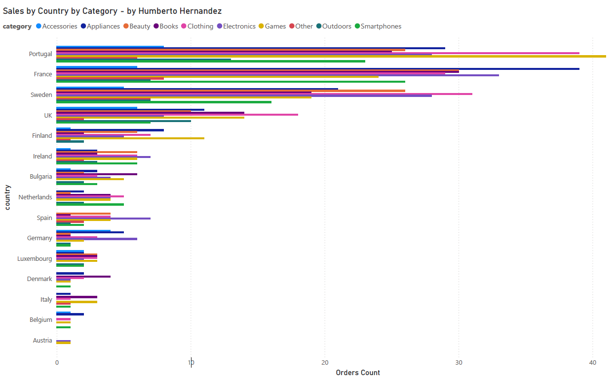
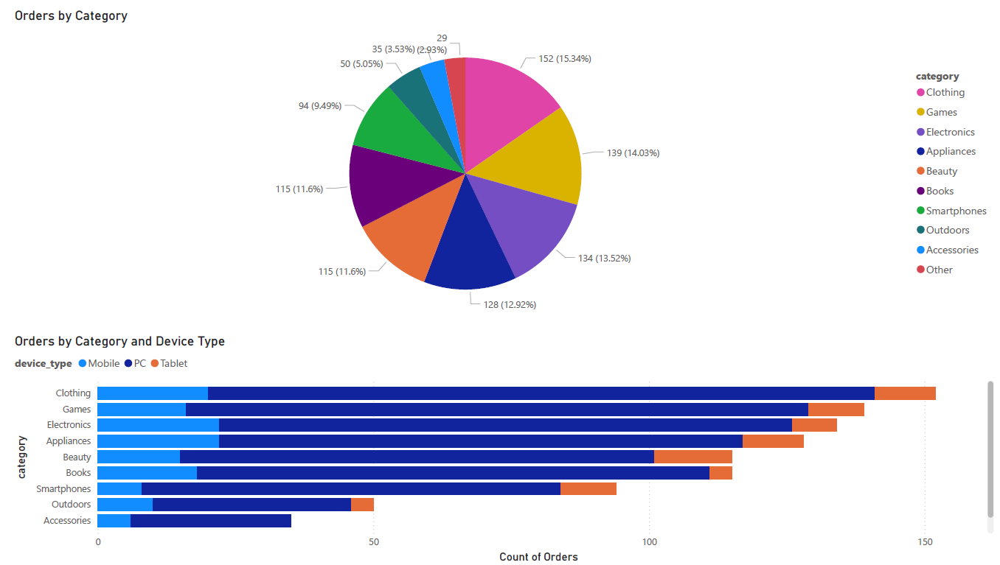
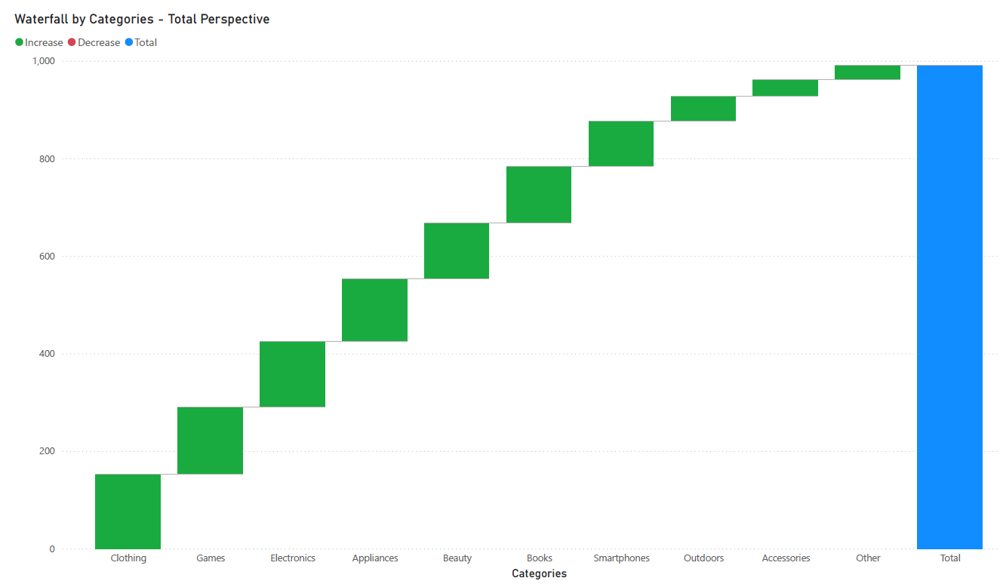
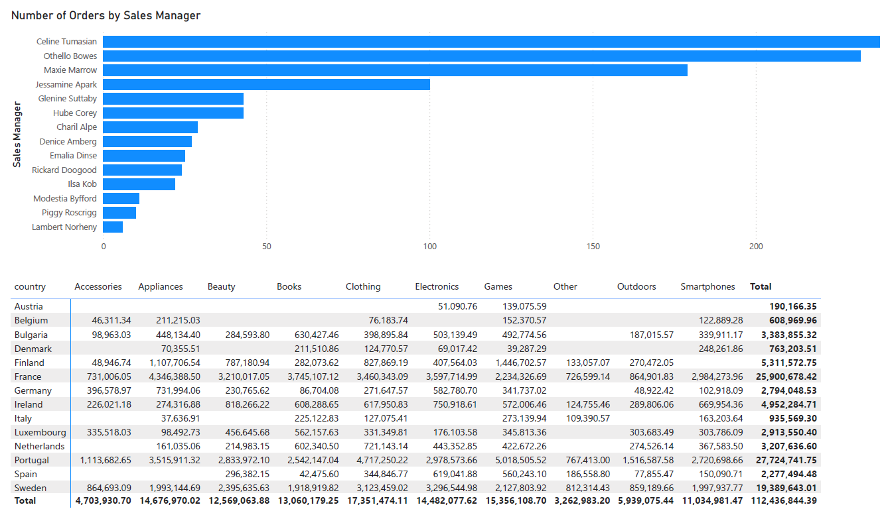
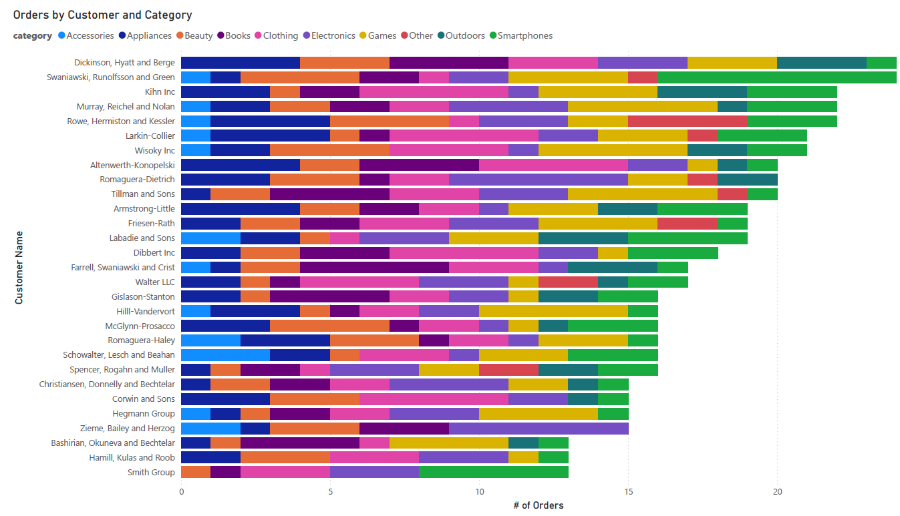

# 📊 E-Commerce Sales Dashboard - Power BI Desktop

## 📌 Project Overview

A professional multi-country sales analytics dashboard built in **Power BI Desktop**, analyzing 1,001 transactions across 15 European countries with over €15M in revenue.

This project demonstrates end-to-end data analysis skills: **data cleaning, transformation, aggregation, visualization, and stakeholder reporting** — all within Power BI using Power Query M and DAX.

---

## 🎯 Business Questions Answered

- Which countries generate the highest revenue?
- What product categories perform best in each region?
- How do sales trends evolve month-over-month (2019-2020)?
- Which sales managers and reps are top performers?
- Who are the top 10 customers by revenue?
- What device types (PC/Mobile/Tablet) drive most orders?
- How do different categories compare by order frequency vs. revenue?

---

## 🛠 Tools & Technologies

| Tool | Purpose |
|------|---------|
| **Power BI Desktop** | Dashboard development & visualization |
| **Power Query M** | Data extraction, cleaning & transformation |
| **DAX** | Measures & calculations |
| **Excel/CSV** | Data source |
| **PDF Export** | Stakeholder distribution |

---

## 📁 Data Transformation Steps (Power Query M)

1. **Promoted headers** and set correct column names
2. **Changed date type using locale** (English US) to fix mixed MM/DD/YYYY and DD/MM/YYYY formats
3. **Removed error rows** from `cost` column
4. **Filtered out NULL values** from `order_value_EUR` and other columns
5. **Created 8 reference tables** using Group By operations:
   - `Sales by Country` (total revenue per country)
   - `Sales by Category` (total revenue per category)
   - `Monthly Sales Trend` (revenue by year + month)
   - `Sales by Manager` (revenue per sales manager)
   - `Sales by Manager & Category` (cross-tab)
   - `Frequency by Category` (order count per category)
   - `Frequency by Country by Category` (2D frequency matrix)
   - `Sales by Country by Category` (2D revenue matrix)

---

## 📊 Dashboard Features & Visuals

| Visual | Insight |
|--------|---------|
| **Clustered Bar Chart** | Country × Category revenue comparison (dodge-style) |
| **Pie Chart** | Market share by product category |
| **Line Chart** | Monthly sales trend (24 months: Jan 2019 - Dec 2020) |
| **Matrix Table** | Country × Category cross-tab with proper sum aggregation |
| **Bar Chart** | Top 10 customers by revenue |
| **Bar Chart** | Sales by sales manager (team performance) |
| **Pie Chart** | Order distribution by device type |
| **KPI Cards** | Total Sales, Total Orders, Average Order Value |

---

## 📈 Key Insights

- **Top 5 Countries by Revenue:** Sweden, Spain, Portugal, Netherlands, Luxembourg
- **Top Categories by Order Volume:** Appliances (139), Beauty (135), Books (134), Smartphones (128)
- **Sales Trend:** Stable performance across 2019-2020 with seasonal peaks
- **Device Type:** PC dominates order volume (85%+)
- **Customer Concentration:** Top 10 customers represent significant revenue share

---

## 📸 Dashboard Preview

| | |
|---|---|
|  |  |
| *Overview Dashboard* | *Orders by Category* |

| | |
|---|---|
|  |  |
| *Waterfall by Categories* | *Number of Orders by Sales Manager* |

| | |
|---|---|
|  | |
| *Orders by Customer and Category* | |

---

## 📁 Repository Structure

ecommerce-sales-dashboard/
│
├── README.md # Project documentation
├── ecommerce_dashboard.pbix # Power BI source file
├── ecommerce_dashboard.pdf # Exported PDF report
│
├── screenshots/ # Dashboard preview images
│ ├── dashboard_overview.png
│ ├── sales_by_country.png
│ ├── monthly_trend.png
│ ├── category_matrix.png
│ └── manager_performance.png
│
└── data/
└── source_data.csv # Raw dataset (anonymized)

---

## 🚀 How to Use

### Prerequisites
- **Power BI Desktop** (free download from Microsoft)
- Windows OS (or Power BI for Mac via browser)

### Steps
1. Download `ecommerce_dashboard.pbix` from this repo
2. Open with Power BI Desktop
3. Explore visuals or refresh data (if source available)
4. Export as PDF from **File → Export → Export to PDF**

---

## 📤 Distribution

This dashboard is not published to Power BI Cloud. Instead, it is distributed as:
- **.pbix file** (for Power BI users)
- **PDF export** (for non-technical stakeholders)
- **Screenshots** (for LinkedIn/GitHub portfolio)

---

## 👨‍💻 Author

**Data Analyst**  
*Power BI | SQL | Python | Data Visualization*

🔗 [LinkedIn](https://linkedin.com/in/your-profile)  
🐙 [GitHub](https://github.com/your-username)

---

## 📅 Project Status

✅ **Completed** — May 2026

---

## 📄 License

This project is for portfolio purposes. Data is anonymized and does not contain real customer information.
